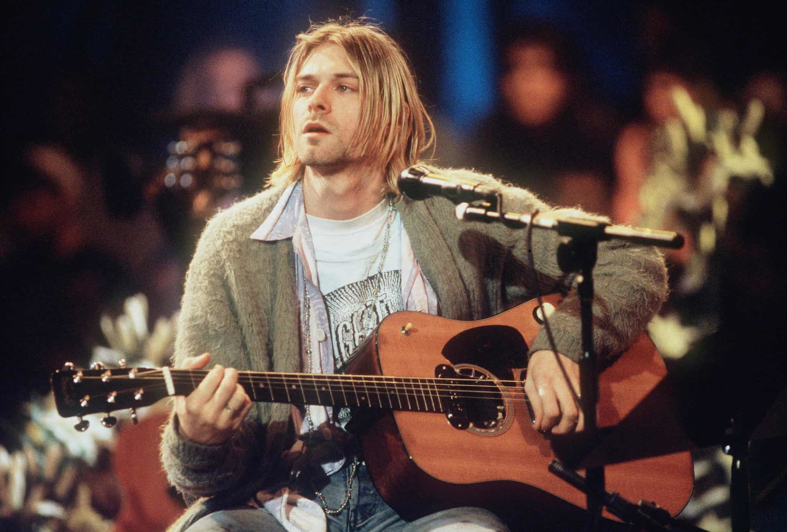
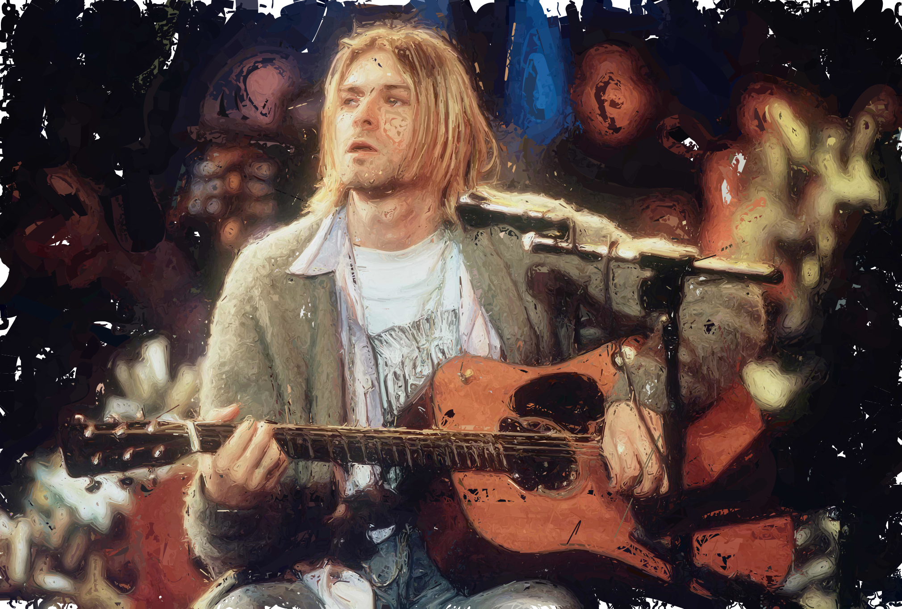

# Stylization of Photographs using Tractography

<div align="center">
  
  
</div>

<br/>
Using the concepts from diffusion tensor imaging (DTI) and image processing,
this project aims to stylize photographs in painterly style.

For details, read the preprint [here](place/holder).

## Usage

Install [uv](https://docs.astral.sh/uv/) and run:

```bash
uv run main.py INPUT_IMAGE OUTPUT_IMAGE [--params PARAMS_JSON] [--orientation-vector {structural,gradient}]
```

The optional `PARAMS_JSON` file can be used to specify parameters for the
algorithm. It should be a JSON file with the following structure:

```json
[
    { // First layer
         "sigma": float,               // Standard deviation for Gaussian smoothing
         "length_lines": float,        // Maximum length of lines in this layer
         "width": float,               // Width of lines in this layer
         "min_length": float,          // Minimum length of lines to draw
         "color_threshold": int        // Minimum color difference to draw a line
    },
    { // Second layer
        ...
    },
    ...
]
```

The `orientation-vector` argument specifies how to compute the orientation. If
`structural` it uses the primary eigenvector of the structure tensor (proposed improvement), if
`gradient` it uses the image gradient (for reference).

The settings used in the preprint can be found in `test-images/params.json`.

## Reproducibility

To reproduce the results in the preprint, run the following commands:

```bash

# Fig 1
uv run main.py test-images/cubain.jpg out_cubain.png --params test-images/params.json --orientation-vector structural

# Fig 3
uv run main.py test-images/picasso.jpg picasso_st.png --params test-images/params_st_vs_gt.json --orientation-vector structural
uv run main.py test-images/picasso.jpg picasso_gt.png --params test-images/params_st_vs_gt.json --orientation-vector gradient

# Stylization of all images in the test datasets (Figures 4-11)
cd test-images
bash run_all.sh # MacOS/Linux
& run_all.ps1 # Windows PowerShell
bash make_montage.sh # MacOS/Linux (requires ImageMagick)

```